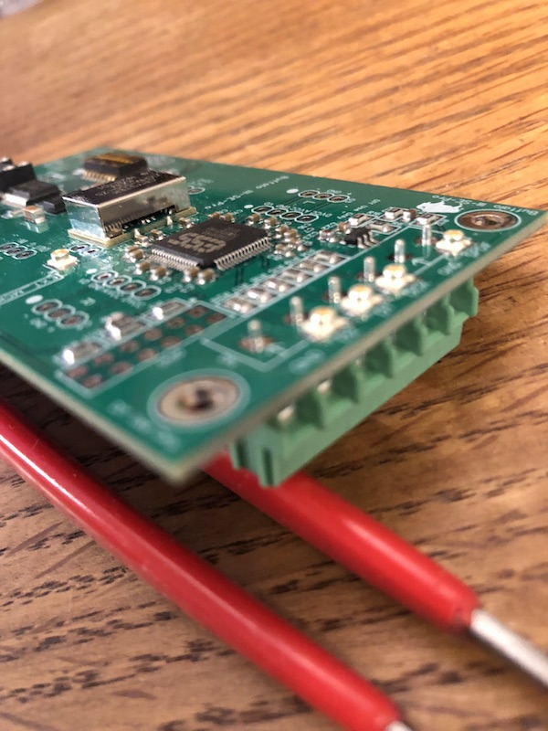
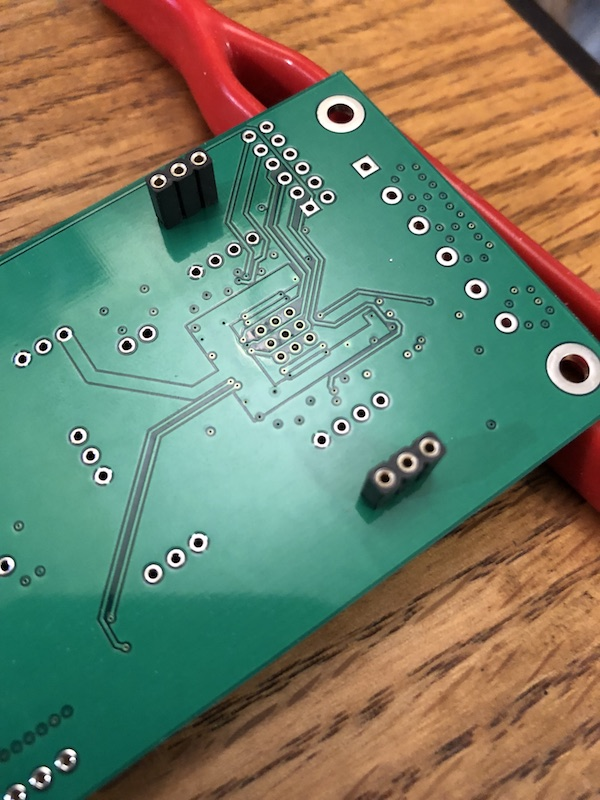

# Overview
---
The Buffalo DAC modules have a long lineage that tracks closely with the ES90xx series of DAC chips
going all the way from the original Buffalo based on the ES9008 to this module based on the ES9028/38 chips with new
modules still in development.

**Features**:
- on-board ultra low phase noise 100Mhz Crystek clock
- accepts both Serial and SPDIF inputs
- on-board consumer to CMOS SPDIF converter 
- on-board controller and port expander for running firmware
- two 8-position DIP switches for configuring firmware
- header for accessing chip GPIOs and Address and Reset signals
- header for accessing controller and port expander
- header for external I2C control
- headers for AVCC,VCC,VDD, and XO(clock) VDD that support both Trident and AVCC modules
- header for Lock/Auto-mute LEDs (on which LEDs can be soldered directly)
- 3.3V regulator for microcontroller and port expander.

# Assembly Notes
---
**Please read this before you start soldering!!!**

### Digital input header
**Important!!!** Because we pre-mount uFL connectors on the PCB if you wish to use the terminal blocks you need to mount the terminal
blocks on the bottom of the PCB - even though the silk is on top.

When using output stages like the Mercury, Ivy, Legato that mount directly to the Buffalo - it is also recommended you 
solder the female analog output headers to the bottom of the board and the male (long tail) headers to the output stage.
