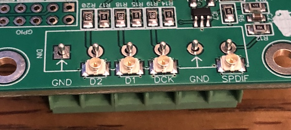
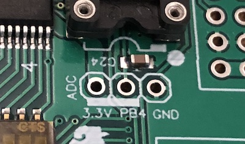
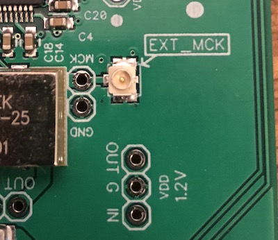
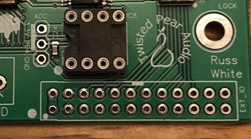
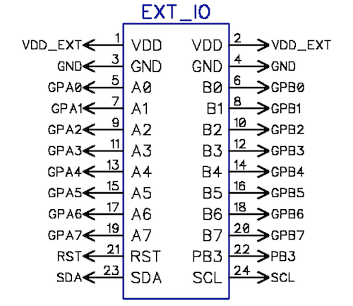

# Overview
---
**Important!!!** For standard stereo firmware please see 
[Buffalo III SE Pro On-Board Firmware](https://github.com/twistedpearaudio/Buffalo-III-SE-Pro-On-Board-Firmware)
you will find all of the DIP switch mappings for that firmware documented there.

It is important to review the firmware settings prior to operating the DAC.

The Buffalo DAC modules have a long lineage that tracks closely with the ES90xx series of DAC chips
going all the way from the original Buffalo based on the ES9008 to this module based on the ES9028/38 chips with new
modules still in development.

The module comes with either the ES9028 or the ES9038 which are identical in function other than supply current 
requirements and output current.

The DAC has a full scale output (0db-fs)  of 0.924 * AVCC at 202Ω for the ES9028 and 50.5Ω for the ES9038 +/- 14%.

**Contents:**
* TOC
{:toc}

## **Features**:
- on-board ultra low phase noise 100Mhz Crystek clock
- accepts both Serial and SPDIF inputs
- on-board consumer to CMOS SPDIF converter 
- on-board controller and port expander for running firmware
- two 8-position DIP switches for configuring firmware
- header for accessing chip GPIOs and Address and Reset signals
- header for accessing controller and port expander
- headers for AVCC,VCC,VDD, and XO(clock) VDD that support both Trident and AVCC modules
- header for Lock/Auto-mute LEDs (on which LEDs can be soldered directly)
- 3.3V regulator for microcontroller and port expander etc
- header for external I2C control including 3.3V(up to 500ma) from controller regulator
- a precision resistor and a filter cap on GPIO2 for DAC optional auto-level adjustment feature (firmware dependant)

# Assembly Notes
---
**Please read this before you start soldering!!!**

## Digital Input Terminal Blocks
**Important!!!** Because we pre-mount uFL connectors on the PCB if you wish to use the terminal blocks you need to mount the terminal
blocks on the bottom of the PCB - even though the silk is on top.

## Analog Output Headers
When using output stages like the Mercury, Ivy, Legato that mount directly to the Buffalo - it is also recommended you 
solder the female analog output headers to the bottom of the board and the male (long tail) headers to the output stage.

The reason for this is that if you ever change output stages you might need varying height clearances - this is done by 
using different length male headers - by using the female header at the DAC and male at the output stage you shouldn't ever need 
to desolder the DAC header if you changed output stages with a different height requirment. If you do it the other way - then
if you ever need to change clearance height you will have to desolder the male header from the DAC.

# Power Requirements:

The VD supply is routed to all of the Trident supply header input pins. It also powers the on-board regulator for the
controller. Be sure you don't exceed the input voltage the Tridents (or any other regulator) and keep in mind that
the ~1.2V supply has large a drop and will get hotter as voltage rises. 

It is advised to use Twisted Pear Audio "Trident SR" regulators (Series Reg) "AVCC SR" modules. The AVCC SR module 
has two separate ultra low noise purpose made series regulators for AVCC_L and AVCC_R - it is designed to sit neatly
over the DAC for an ultra short path to the DAC supply pins. 

**Important!!!** Trident SR and AVCC SR should have an input voltage of 5VDC. It is not recommended to exceed 5VDC on 
the VD input when using those modules. 

In all - this module requires 5 regulators (all voltages DC):

- VDD: ~1.2 - 1.3V ~220ma *Note - nominally this is 1.2V but ESS sent a design notice that it should actually be above 1.25V '
and no more than 1.5V when operating with sample rate above 192Khz or DSD128 with the ES9038*
- DVCC: 3.3V ~10ma
- AVCCL: 3.3V-4V ~100ma
- AVCCR: 3.3V-4V ~100ma
- VDD_XO: 3.3V ~ 25ma

*note: current is stated for ES9038 with 44.1khz input signal and 100Mhz master clock current consumption rises with 
sample rate - ES9028 will use less current.

# Module Headers

## Digital Inputs

How input is handled is firmware dependant - please see the firmware documentation.

The module supports both Serial data input (DSD/PCM) and SPDIF input.

Serial input takes:

- DCK - bit clock
- D1 - PCM LRCK(Frame clock) or DSD channel 1
- D2 - PCM Data or DSD channel 2

The SPDIF input accepts consumer level or CMOS level SPDIF - the SPDIF signal is level shifted to CMOS and sent to 
the DATA_3 pin on the DAC

Controllers switching between Serial and SPDIF should select DATA_3 as the SPDIF source.

## Volume Control ADC

Some firmware supports volume control via the ADC header.

For such firmware simply wire a 10K pot to the ADC header with the wiper to PB4 and 3.3V to the high end and GND 
to the low end of the pot. This makes a simple convenient volume control from the panel.

If your firmware supports volume control but you want to output full scale always - simply install a jumper from
the 3.3V pin to the PB4 pin as indicated by the bar on the PCB silkscreen. This way you can apply analog volume control
if desired.

## External MCK

The module is designed to accept an external CMOS level master clock. 
**Important!!!** You must omit the VDD_XO supply to use an external clock.

## External IO

All of the port expander GPIO pins and most of the on-board controller pins are accessible on the "EXT_IO" header.
Use this when you want to externally switch features.

Keep in mind in most cases the firmware will weakly pull up the IO net - so your switch should close to GND if that is
the case. Refer to the firmware documentation for switch functions.

The DIP switch SW1 maps to GPA(0-7) and SW2 to GPB(0-7) pos 1 = GPx0 pos 8 = GPx7.

###EXT_IO Pins and Switch Mapping
<table>
    <tr><td>2 VDD_EXT</td><td>4 GND</td><td>6 SW2-1</td><td>8 SW2-2</td><td>10 SW2-3</td><td>12 SW2-4</td><td>14 SW2-5</td><td>16 SW2-6</td><td>18 SW2-7</td><td>20 SW2-8</td><td>22 PB3</td><td>24 I2C-SCL</td></tr>
    <tr><td>1 VDD_EXT</td><td>3 GND</td><td>5 SW1-1</td><td>7 SW1-2</td><td>9 SW1-3</td><td>11 SW1-4</td><td>13 SW1-5</td><td>15 SW1-6</td><td>17 SW1-7</td><td>19 SW1-8</td><td>21 DAC_RST</td><td>23 I2C-SDA</td></tr>
</table>

## GPIO

The GPIO header exposes DVCC and GND from the DAC as well as the following:

- GPIO1-4 controllers can set the GPIO pins for special functions. This module facilitates using GPIO4 for indicating
lock and GPIO1 for indicating AUTOMUTE by including series resistors and connecting those nets to an LED header.
If you plan on using GPIO1 or GPIO4 for some other purpose it is recommended you leave the LEDs off.
- DAC_ADDR sets the DAC's I2C address. Open or Low = 0x90 and High = 0x92.
- DAC_RESET active low DAC reset. The on-board controller is connected to this pin. 
Any controller must properly reset the DAC after power up conditions are met. 
**Important** do not short this pin high or low if you are using the on-board controller.

## LED(LOCK/AUTOMUTE)

